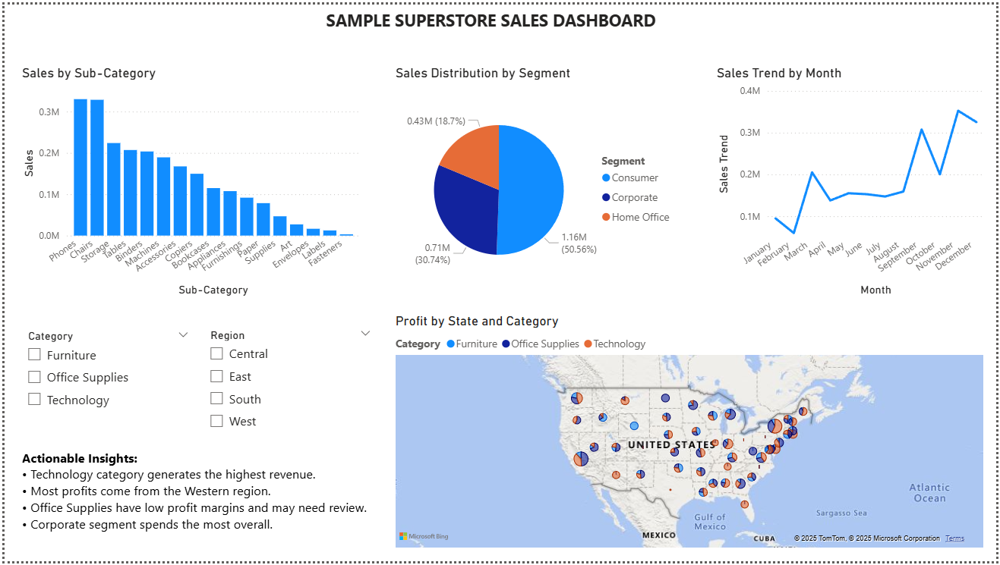

# ELITE_TECH_INTERNSHIP

🗓 Duration: June 30 – July 29, 2025  
🎓 Intern: Siddharth Bamania  
🧠 Internship Domain: Data Analytics  
🏢 Organization: Elite Tech Intern

## Internship Tasks

### ✅ Task 1 – Big Data Analysis
Analyzed the Titanic dataset using PySpark to demonstrate scalable data processing.

### ✅ Task 2 – Predictive Analysis
Built a classification model using the Breast Cancer dataset with feature selection and model evaluation.

### ✅ Task 3 – Dashboard Development
Created an interactive Power BI dashboard using Sample Superstore dataset.

📁 `superstore_dashboard.pbix` – Original Power BI file  
📷 `dashboard_preview.png` – Preview of the dashboard (see below)

### ✅ Task 4 – Sentiment Analysis
Performed NLP-based sentiment classification on Twitter data using Logistic Regression and TF-IDF.
